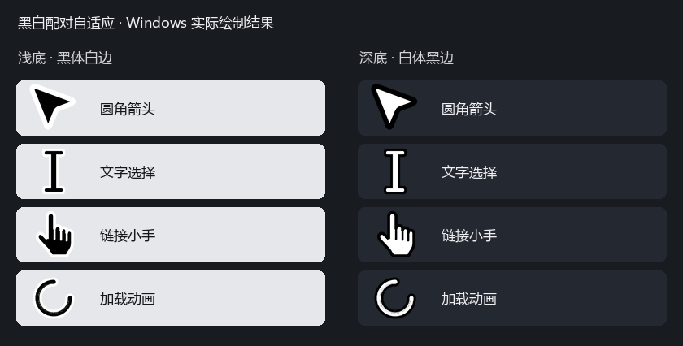

# Pointer

Windows 黑白自适应圆角光标：浅色背景显示**黑色主体、白色边框**，深色背景显示**白色主体、黑色边框**。覆盖 17 种系统状态，保留加载动画，无蓝光。

`DEV` 是开发分支，当前目标版本为 1.2.0：普通箭头和链接小手支持两种独立动效：默认按下时箭头下方两尖固定、顶部尖向左下压弯，小手逆时针倾斜约 12°，也可选择原来的缩小约 10%。长按保持，松开约 150 毫秒恢复。开始菜单或开发包中的“使用倾斜动效”“使用缩小回弹”可切换，选择会保留到下次登录。点击热点固定，深浅两套配色均适配。应用自绘光标可能不采用系统动效。



## 一键安装

1. 从 [Releases](https://github.com/ReactionForge/Pointer/releases/latest) 下载 Windows x64 ZIP。
2. 完整解压，双击 `Pointer/一键安装.cmd`（或 `install.cmd`）。
3. 安装后，从开始菜单的 **Pointer** 文件夹启用、停止、恢复原光标或打开测试页。

支持 Windows 10/11 x64，无需 Python、管理员权限或联网。程序安装到 `%LOCALAPPDATA%\Pointer\app`，备份保存到相邻的 `data` 目录。升级时再次运行新版本安装入口，已有原始备份会保留。安装成功后可删除下载包和解压目录。

发布包未签名，ZIP 的 SHA-256 校验文件随 Release 提供。详细操作见[使用说明](docs/usage.txt)。Windows“照片”的图片抓手及应用自行绘制的光标可能不采用系统方案。

安装或启用会注册当前用户的登录启动项。v1.1.1 起，已有启动路径不变时不会重复写入；重新启用和升级也不会先删除再添加。后台配色切换不修改启动项。“停止自动切换”和“恢复原光标”会取消登录启动，再次启用才重新注册。

## 项目结构

```text
Pointer/
├── src/pointer/             # 应用、Windows 配置与后台切换
├── assets/cursors/          # 自适应、固定和历史实验光标资源
├── tools/
│   ├── generate/            # 光标与预览生成工具
│   ├── verify/              # Windows 原生绘制、热点与动画检查
│   ├── build_release.py     # 发布包构建
│   └── serve_test.py        # 本地测试网页服务
├── tests/                   # 自动化测试，不修改系统设置
├── web/cursor-test/         # 离线交互测试网页
├── docs/                    # 架构、操作说明与公开预览
├── packaging/windows/      # Windows 打包入口和随包说明
├── scripts/windows/        # 源码模式快捷命令
├── requirements/           # 构建与绘图依赖
├── .github/workflows/       # 自动构建和发布
├── pyproject.toml           # Python 包配置与命令入口
└── VERSION                  # 唯一版本号来源
```

本机备份、调试截图和运行记录集中在 `.local/`，构建输出位于 `build/`、`dist/`；这些目录不上传。模块职责、运行流程及路径规则见[架构说明](docs/architecture.md)。

## 开发与验证

在 Windows x64 和 Python 3.13 环境中：

```powershell
python -m venv .build-env
.\.build-env\Scripts\python.exe -m pip install -r requirements/build.txt
.\.build-env\Scripts\python.exe -m pip install --no-deps -e .
.\.build-env\Scripts\python.exe -m unittest discover -s tests
.\.build-env\Scripts\python.exe -m pointer --diagnose --quiet --report .local/reports/diagnostics.json
```

源码命令统一使用 `python -m pointer`（或安装后的 `pointer` 命令）。`--apply` 启用并修改当前用户设置；`--stop` 停止自动切换；`--restore` 恢复原方案；`--test-page` 打开离线测试页。源码模式使用仓库资源，启用期间应保留仓库位置。

本地网页测试服务：

```powershell
.\.build-env\Scripts\python.exe -m tools.serve_test
```

访问 `http://127.0.0.1:9167/`。绘图生成与原生验证工具需要额外安装 `requirements/art.txt`，操作入口见 [assets 说明](assets/README.md)。

点击动效测试区位于 `http://127.0.0.1:9167/#click-motion`，请分别检查箭头、小手、长按、松开和连续点击。网页计数表示事件已收到，光标外观由你手动判断。

## 构建和发布

```powershell
.\.build-env\Scripts\python.exe -m tools.build_release
```

输出 `dist/Pointer-v<版本>-windows-x64.zip` 和校验文件。包内资源仍按 `assets/`、`web/` 分类，个人数据不会打包。

更新 `VERSION` 后推送对应的 `v<版本>` 标签，[GitHub Actions](https://github.com/ReactionForge/Pointer/actions/workflows/release.yml) 会运行测试、构建和 EXE 诊断，再创建 Release。手动触发只生成构建产物。
