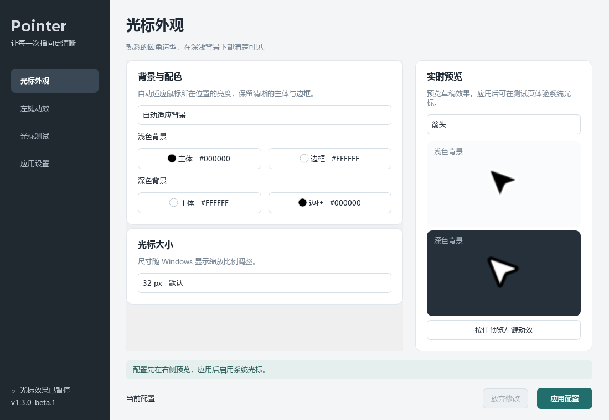
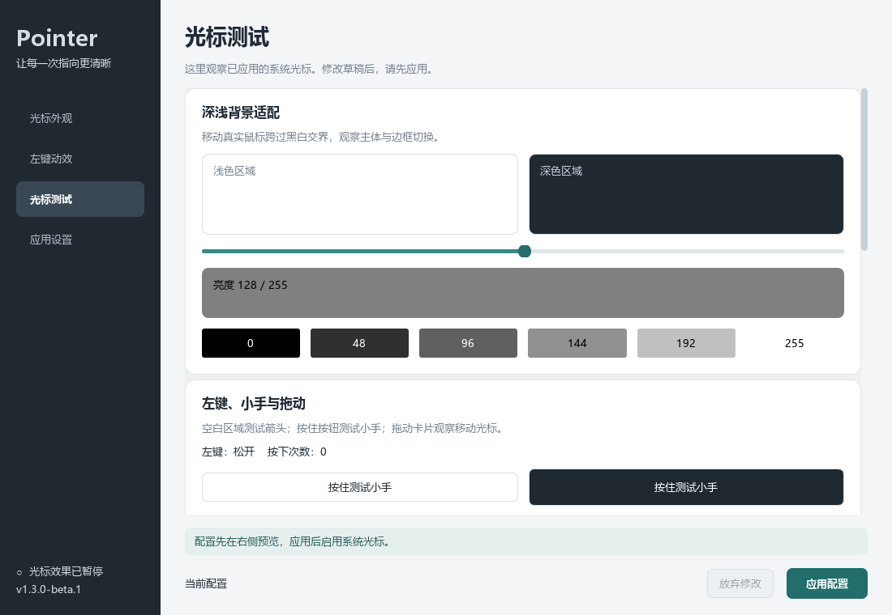

# Pointer

Windows 圆角光标桌面 APP。浅色背景黑色主体、白色边框；深色背景白色主体、黑色边框。覆盖 17 种系统光标，保留加载动画，无蓝光。

**DEV 桌面预览版：1.3.0-beta.5**。开发修改只推送 DEV，稳定版仍为 v1.1.1。

[下载安装 EXE](https://github.com/ReactionForge/Pointer/releases/download/v1.3.0-beta.5/Pointer-v1.3.0-beta.5-setup-x64.exe) · [下载便携 ZIP](https://github.com/ReactionForge/Pointer/releases/download/v1.3.0-beta.5/Pointer-v1.3.0-beta.5-windows-x64.zip) · [预览版与校验文件](https://github.com/ReactionForge/Pointer/releases/tag/v1.3.0-beta.5)

动效、侧栏和灰度支持精确数值输入及默认参数重置。底部操作条显示外观保存与光标应用状态；显式应用会启动光标效果。最新实施和验收范围见 [beta.4 验收记录](docs/releases/1.3.0-beta.5.md)。



上图保留 beta.1 界面记录；beta.3 起使用已认可的 Material 界面。

## 使用

1. 安装 EXE，或完整解压 ZIP 后打开 `Pointer.exe`。支持 Windows 10/11 x64，无需 Python、管理员权限或联网。
2. 在 APP 调整主体与边框配色、大小、点击动效、强度和按下/松开时间。右侧预览草稿，点击 **应用更改** 后才启用系统光标。
3. 打开 **光标测试**，体验黑白交界、亮度变化、箭头、小手、输入、拖动、等待与各类缩放状态。
4. 在 **应用设置** 中选择开机启动、暂停/恢复、导入导出配置或恢复 Windows 原光标。

设置页的浅色/深色选择只改变界面。侧栏透明度和背景模糊分别控制，滑轨右侧可直接输入数值，按回车或离开输入框后预览；“保存外观”保存到独立文件，“取消预览”恢复已保存值。透明度按深浅主题分别记忆，外观设置不产生系统光标配置草稿。

真正的背景模糊使用 Windows Composition host backdrop 与 Gaussian，支持的 Windows 11 环境可调 0–48（0 关闭模糊）；组件已随包交付，无需用户编译。Windows 10、不支持的合成环境、高对比、系统关闭透明效果或窗口失活时使用回退，不修改 Windows 全局设置。混合 DPI、跨屏和 Snap 尚未完成实机验收。

关闭设置窗口后，已启用的后台光标效果继续工作。暂停与开机启动互相独立，未变化的启动项不会重复写入。新安装默认不启用开机启动；已有用户升级保留选择。

默认动效：箭头整体向左下倾斜约 6°，顶部移动明显、下方两尖轻微跟随；小手倾斜约 12°。长按保持，松开约 150 ms 回正。保留缩小回弹模式，各帧点击热点固定。



配置与原光标备份位于 `%LOCALAPPDATA%\Pointer\data`，程序文件位于相邻 `app` 目录。商店应用宿主可能重定向路径。ZIP 首次应用时部署到持久目录，应用成功后可以移动或删除解压文件夹。升级保留用户数据，卸载前恢复原光标；恢复失败会中止卸载。

测试页使用真实 Windows 系统光标。Windows“照片”的图片抓手及其他软件自绘的光标可能使用自身资源。文本编辑时闪烁的插入竖线由应用控制。点击次数表示收到了事件，外观与形变请实际观察。

## 清晰的项目架构

```text
src/pointer/
  application.py, cli.py, bootstrap.py, paths.py
  cursor/                 # 配置、资源缓存、动效与唯一绘图实现
    art/
  windows/                # 系统方案、后台引擎、启动、安装与窗口协调
  ui/                     # 主窗口、预览、工作线程与原生光标
    pages/                # 外观、动效、测试、应用设置
assets/cursors/            # 正式默认资源与保留的历史实验资源
packaging/windows/         # 安装脚本、入口、图标、许可证与随包说明
scripts/                   # 生成、构建、安装包验证和开发辅助
  verify/                  # Windows 原生资源检查
  windows/                 # 源码模式快捷入口
requirements/              # 固定版本运行、构建及开发依赖
tests/unit/, integration/  # 单元检查与显式隔离包验证
web/cursor-test/            # 原网页，保留为开发辅助
docs/                      # 使用、架构、设计和计划
.github/workflows/          # DEV 构建及预览版发布
```

界面只调用应用层，系统修改集中在 Windows 层；预览和 CUR/ANI 共用绘图实现。个人数据、截图日志和构建输出留在 `.local/`、`build/`、`dist/`，不上传。详见[架构说明](docs/architecture.md)与[使用说明](docs/usage.txt)。

## 开发与验证

Windows x64、Python 3.13：

```powershell
python -m venv .build-env
.\.build-env\Scripts\python.exe -m pip install -r requirements/dev.txt
.\.build-env\Scripts\python.exe -m pip install --no-deps -e .
.\.build-env\Scripts\python.exe -m unittest discover -s tests
.\.build-env\Scripts\python.exe -m pointer --gui
.\.build-env\Scripts\python.exe -m pointer --diagnose --quiet
```

单元测试禁止真实系统设置写入。打包集成检查需显式设置 `POINTER_PACKAGE_ROOT`，只使用临时安装/数据目录。源码 `--apply` 会修改当前用户光标，使用期间应保留仓库位置。

`--stop` 暂停效果，`--restore` 恢复最初光标，`--tilt`/`--shrink` 切换动效，`--test-page` 打开 APP 原生测试页。`--run` 仅启动后台，不加载 Qt。`--data-dir`、`--install-dir` 提供隔离路径。

原网页开发服务：`python -m scripts.serve_test`，访问 `http://127.0.0.1:9167/`。资源生成与原生检查见 [assets 说明](assets/README.md)。

## 构建与预览版发布

```powershell
.\.build-env\Scripts\python.exe -m scripts.build_release
```

需要现有 .NET Framework 编译器和 Windows WinRT 元数据来构建随包背景组件；用户运行发布包不需要编译器。安装包构建需要 Inno Setup 6，可用 `--compiler` 指定路径。没有 Inno 编译器时，`--skip-installer` 仅构建开发 ZIP；`--output-root .local/<新的构建目录>` 将候选 ZIP 输出隔离。构建环境隔离其他工具 DLL，保留 Qt Widgets 所需的平台插件、动态库和许可说明。

DEV 推送会运行测试、构建 EXE/ZIP、打包诊断、隔离安装升级卸载检查；成功后保存构建产物。对应版本标签发布预览版，标记 prerelease，不替换稳定版。压缩包和安装 EXE 都有 SHA-256 校验文件。发布包尚未代码签名。
