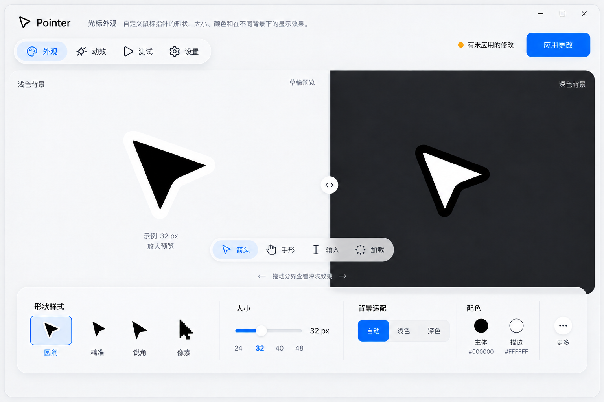
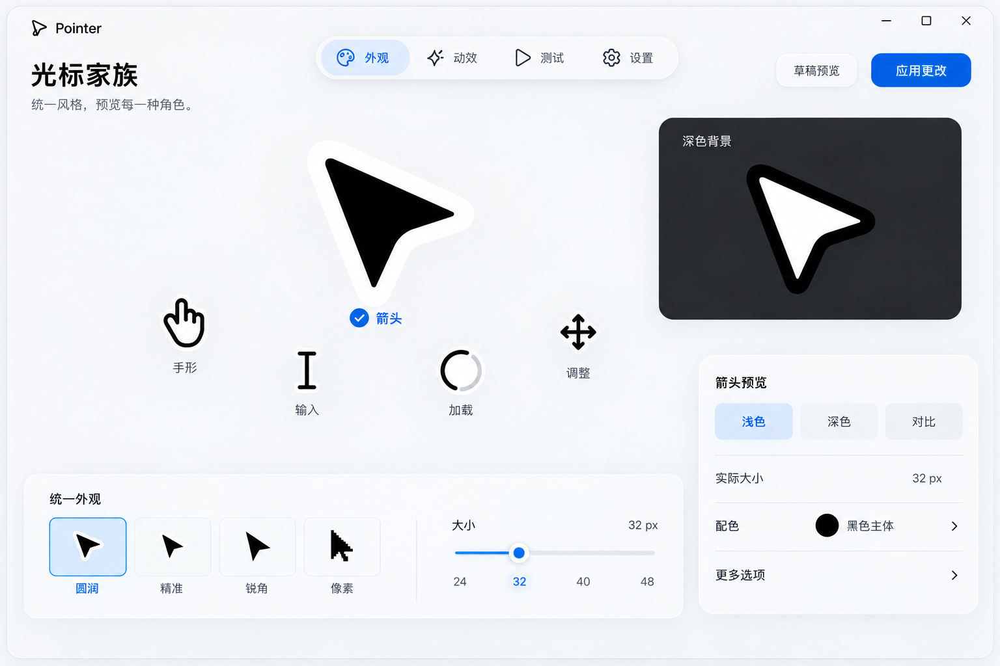
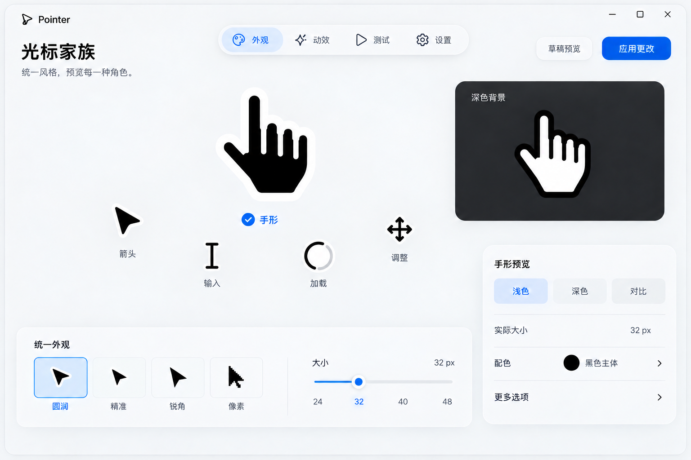
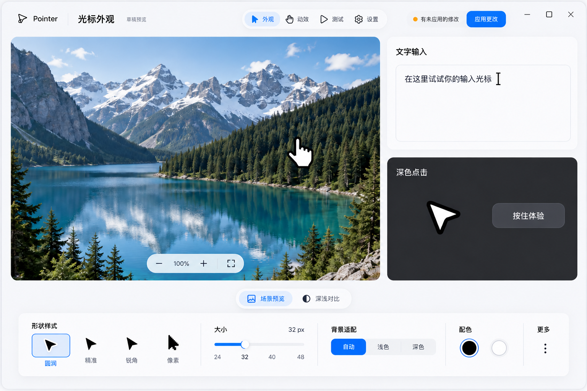

# Pointer 布局升级 · 第三轮

日期：2026-10-06。分支：DEV。模式：Operate。状态：布局与交互构图提案，等待视觉确认，尚未实施。

用户认可第二轮比前一版进步很多，并要求继续优化，尤其是布局，要有生命力、创意和新意。本轮保留 Apple 软件家族的材质、字体、黑白光标与无光晕要求，改变空间组织和操作关系。

## 空间判断

第二轮 A 的视觉重心虽然已转向光标，但左导航、中预览、右属性仍将任务锁在三条竖向区域；两个同等大小的背景块、四个同等形状项及完整属性列同时出现，使节奏较平均。顶部角色工具已提供上下文，仍有潜力把更多控制靠近正在观察的对象。

本轮的主要路径是“选形状 → 在内容中观察 → 调整参数 → 按住比较 → 应用”。主角是当前光标与其场景；共享外观设置靠近一起，系统设置与实际测试保持独立。创造性来自任务关系，导航和应用位置仍稳定。

| 第二轮 | 第三轮 | 为什么 |
| --- | --- | --- |
| 同等大小的预览与固定属性列 | 主角与配角形成尺度差，属性收进工具架 | 让视线有明确方向 |
| 同时展示完整参数 | 首屏常用参数，颜色和更多选项按需展开 | 保持轻盈，保留功能 |
| 固定对半的深浅块 | 可拖动分界，角色焦点或真实场景 | 比较成为操作的一部分 |
| 材质精致但节奏平均 | 广阔舞台与紧凑工具形成疏密变化 | 在同一语言中创造张力 |
| 生命力主要依赖静态质感 | 操作改变焦点、边界和相关控件 | 让变化有原因、可预测 |

## 三种完整布局

### A · 流动舞台

大幅深浅画布、可拖动的分界、靠近预览的角色工具和底部横向工具架。共享形状、大小、背景策略、配色和更多选项集中在一处；没有常驻竖向属性列。顶部导航与应用位置固定。

拖动分界直接改变背景范围，光标预览使用既有背景策略。分界也能通过键盘和数值调整，不能把拖动设为唯一入口。舞台保持光标热点和标注可见，工具不会追着鼠标漂移。

### B · 光标家族

一个主角与多个较小角色组成浅弧，展示整套光标的关系。统一外观参数在横向形状区；当前角色的对比与更多控制在较小的上下文工具区。选中手形、输入或加载时，该角色成为观察焦点。

浅弧是一种排序布局，不是自动旋转的轨道。角色顺序固定，可通过方向键和标记选取；在窄窗口变为有序列表。选择角色只改变预览，形状、大小和配色仍是共享设置；本轮没有新增逐角色配置能力。

下面是同一布局切换到手形的状态稿，用于审阅焦点与上下文的变化，不是第四种构图。

### C · 情境工作台

较大的图片拖动场景，与较小的文字输入及深色点击场景形成非对称关系。底部工具架管理共享外观；“场景预览 / 深浅对比”提供两种观察方式。图片、文字和按钮是可操作的内容，布局因内容与任务而有变化。

这里展示的是草稿预览。图片场景只能演示内部预览手形与拖动；真实 Windows 光标验证仍进入“测试”页，并使用已应用的配置。不能用界面绘制的手形替代系统测试结论。

## 生命力的行为合同

- 选择：状态和数据立即更新；鼠标焦点指示或角色位置接续约 140–180 ms。键盘立即完成，不等待排演。
- 拖动：分界、参数与图片同步跟手；数值始终可读，不对人的输入加弹性延迟。
- 按住：用既有真实轮廓和时间参数预览左键动效，顶部尖向左下较明显移动，下方两尖轻微跟随。
- 上下文：相关参数在固定工具区展开；不把按钮搬到鼠标旁，不让应用操作换位置。
- 应用：固定位置显示真实处理与结果，失败保留草稿。尚未完成不能显示成功。
- 静止：没有待机呼吸、轨道旋转、粒子、自动切页或磁性光标。减少界面动效时保留所有状态和功能。
- 中断：新操作从当前值接续；失焦、切页、关闭弹出层时结束临时按下与等待状态。

## 适配与整套页面迁移

参考画布为 1180×800 logical px，生成图为高分辨率构图；图中的 32 px 示例不是在任意缩放下的一比一测量。

- 880×620：优先保留主操作与常用参数；工具架重排为两行或可滚动分组，预览可折叠。B 的角色浅弧转为线性列表；C 只显示当前场景，场景切换入口保留。
- DPI 与长文字：用实际 Qt 字体度量；不缩小文字或把整页当图片缩放。
- 聚焦与遮挡：弹出颜色区不能遮住必需值与主操作；触发器和焦点回退固定，滚动容器保留键盘可达性。
- 外观：三种布局均保留四形状、八配色、大小、深浅策略与高级颜色/可选光晕入口。
- 动效：使用所选舞台结构，工具架切换为六模式、强度、按下/松开时间；不混入外观参数。
- 测试：场景占据主画布，角色或场景工具承担导航；保持真实共享光标句柄验证，显示真实输入状态。
- 设置：系统偏好仍使用清晰分组行，背景与工具材质一致；设置页无需强行模仿角色浅弧或照片布局。
- 导入/导出、托盘、更新、恢复与启动规则继续沿用第二轮合同。保留原始备份，不改写未变化的启动项。

## 图与实现的边界

这些 PNG 是设计稿，不是已经可操作的 APP。照片为生成的场景示意，不是测试资产已交付的声明。批准后单独制作/选择可用测试素材，文字和控件以真实 Qt 元件实现。所有光标几何继续使用 cursor/art，不能照着生成图重画。其他造型和角色小图以当前源码为准。

保留 PySide6 Qt Widgets，不引入浏览器引擎。内部功能层用可控的材质绘制；原生背景效果是可选增强，不支持或减少透明度时采用稳定不透明表面。没有以创意布局为理由添加持续截图或全窗动态模糊。

UI/UX Pro Max 对“progressive disclosure”两次查询未找到适合此原生桌面布局的匹配，不采用或持久化其偏离主题的网页结果。布局和披露判断依据现有任务与通用 UX 原则，明确作为本项目设计判断。

## 审阅与下一步

三种使用同一 Apple 材质世界。本轮审阅的是组织方式与焦点关系，不重新选择配色或字体。选择后把批准构图测量为区域、间距、控制状态和布局规则，再更新实施计划并实现。

建议以 B 的光标家族组织外观页，吸收 C 的情境结构组织测试页：前者体现产品自己的角色关系，后者让测试有实际操作内容。A 可作为深浅对比观察模式的结构参考。此建议尚未获用户批准，不能混作已经选定的实现合同。

本轮只提交设计与提示词。产品源码和系统光标不改动。正式 Windows 构建完成后运行完整 unittest 与打包 --diagnose，再完成独立审查；不创建发布标签。
