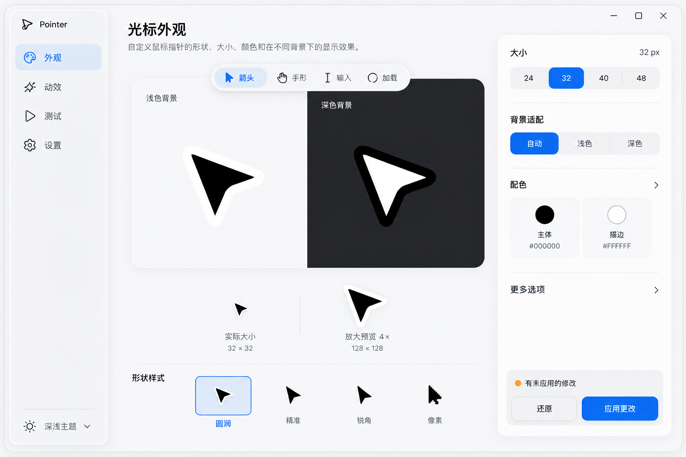
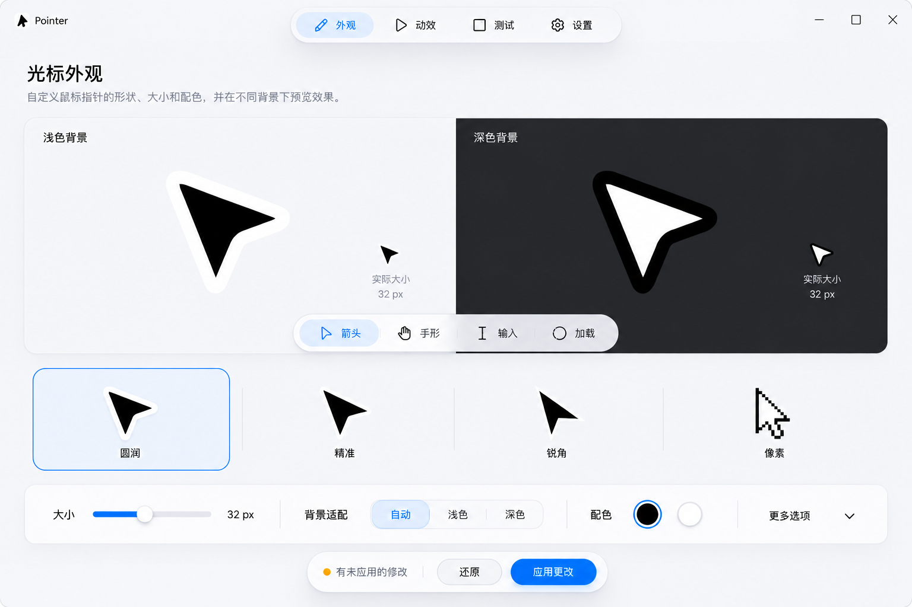
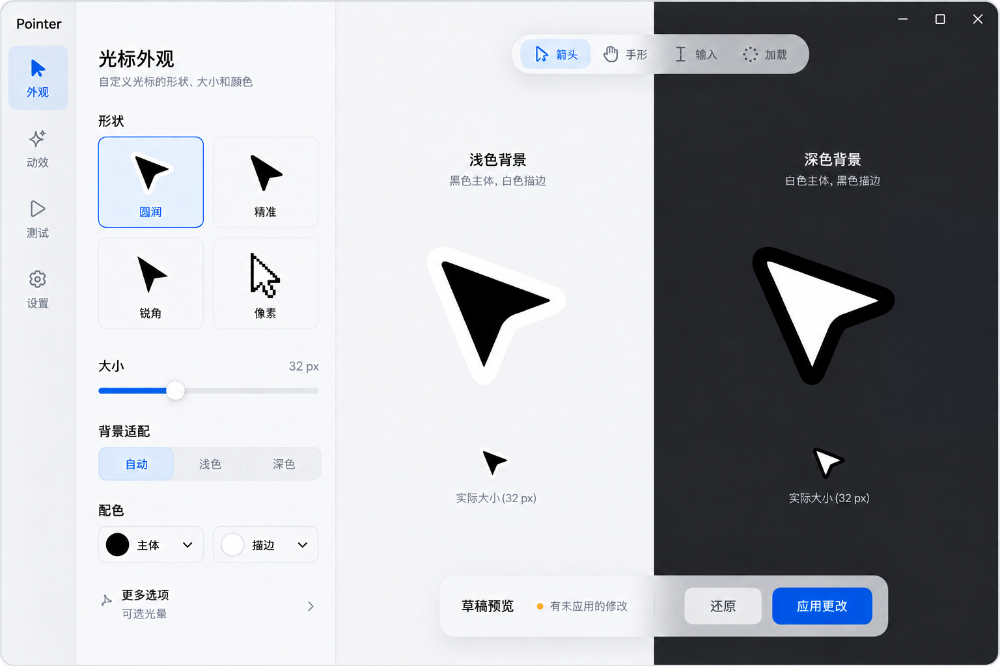
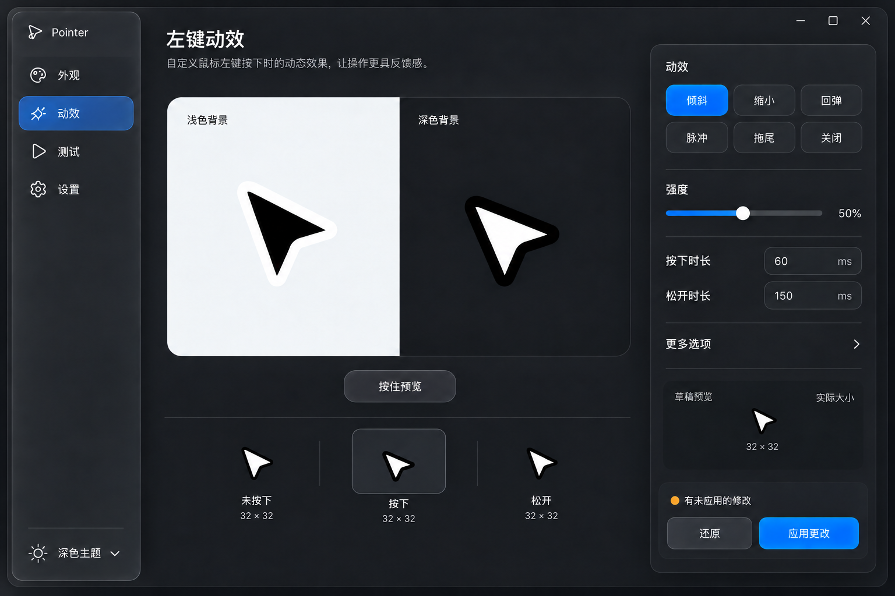
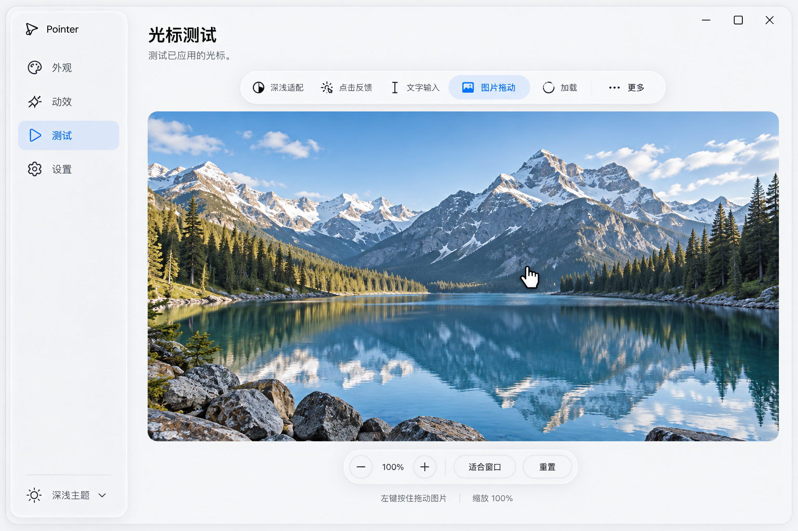
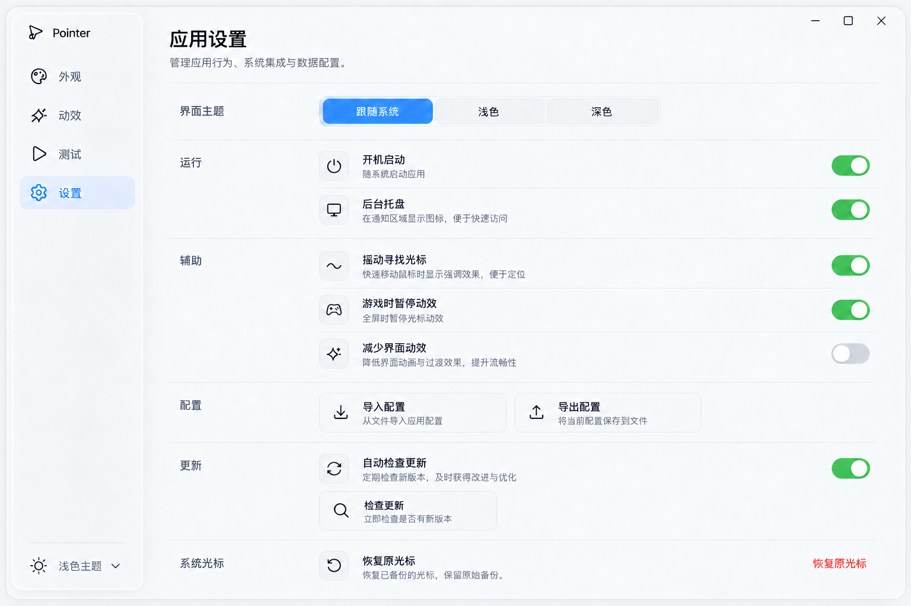

# Pointer 苹果系统风格 UI 与交互重构

日期：2026-10-06。目标分支：DEV。状态：高保真视觉与交互提案，等待用户确认；尚未实施产品界面。当前布局进展见[第三轮布局升级](apple-layout-upgrade.md)。下方第二轮资料保留为材质与功能合同参考；新的布局以第三轮为准。

## 本轮重构目标

用户认为第一轮变化不大，要求参考苹果系统的顶级设计感与交互感。本轮保留已确认的“苹果软件系列风”和“先出界面图再实现”，重新设计工作区结构、材质层次、组件细节和反馈连续性。第一轮平面化分组设置稿已被本轮取代。

四项技能分工：Impeccable 组织产品事实、完整构图与审阅；UI/UX Pro Max 校准层级、控件、焦点、阅读和主题；Emil Design Engineering 设计有目的、立即响应、可中断的动作；Canvas Design 以“澄层”统一空间、黑白轮廓与材质工艺。高保真图使用内置 imagegen；不是当前程序的截图。

## 官方参考如何转化为 Pointer

Apple 的 Materials 指南将 Liquid Glass 放在导航和控制的功能层，强调与内容层区分；Motion 指南强调反馈与输入方式的关系。macOS 官方界面实例中的侧栏、工具栏和内容画布提供层级参考。我们据此做以下适配，具体工作区与时间参数是 Pointer 的设计判断。

| 第一轮 / 现状 | 第二轮提案 | 目的 |
| --- | --- | --- |
| 设置卡片占据首屏，预览较小 | 光标成为主画布，属性变为任务相关检查器 | 调整时始终看见结果 |
| 平面侧栏与分组框相近 | 轻盈悬浮功能层、安静内容层、短暂反馈层 | 明确前后关系和操作位置 |
| 圆角卡片承担全部层级 | 依靠材质、留白、文字和分组行组织 | 避免卡片堆叠 |
| 多个测试场景形成长页面 | 场景切换后进入可操作的完整画布 | 测试输入、拖动、加载更直接 |
| 各控件有不同的局部反馈 | 统一按压、选择、拖动与结果反馈 | 连续操作具有一致手感 |
| 静态界面图只呈现外观 | 外观三种构图，加动效、测试、设置整套页面 | 验证设计能覆盖完整 APP |

参考：[Materials](https://developer.apple.com/design/human-interface-guidelines/materials)、[Liquid Glass](https://developer.apple.com/documentation/technologyoverviews/liquid-glass)、[Motion](https://developer.apple.com/design/human-interface-guidelines/motion)、[macOS 官方界面示例](https://www.apple.com/newsroom/2025/06/macos-tahoe-26-makes-the-mac-more-capable-productive-and-intelligent-than-ever/)。

## 三种工作区构图

三种均使用 DESIGN.md 的 Liquid Focus 语言；只比较结构，保持材质、字体与光标风格一致。

| 构图 | 使用方式 | 取舍 |
| --- | --- | --- |
| A · 焦点工作区，推荐 | 左侧导航，中间大幅预览，右侧上下文属性 | 预览与参数常驻，应用操作位置稳定 |
| B · 画廊工作区 | 顶部导航，大幅对比，下方形状与横向属性 | 浏览造型更直观；窄窗口需要调整控制区 |
| C · 紧凑工作室 | 窄导航，左侧属性，右侧整面预览 | 光标更突出；属性列需要独立滚动 |

推荐 A，因为它适合连续比较配色与按下效果，并能让形状、大小、背景策略和应用操作保持可见。推荐不等于用户已经批准。

## 整套页面

### 外观

主画布支持浅色、深色和并排对比，角色工具栏切换箭头、手形、输入、等待与后台加载；放大预览与实际配置尺寸分开标注。形状条使用四种现有造型。基础检查器显示大小、背景策略与配色；八种预设、自定义深浅主体/描边和现有可选光晕保持可达。

图中的 32 px 是示例配置。静态概念图经过缩放，不构成实际一比一尺寸证明；实施后由唯一光标绘制源和 Qt DPI 度量呈现。图中其他造型小图是构图示意，最终必须使用现有真实几何，不能照着生成图另画光标。

默认保留浅底黑主体白描边、深底白主体黑描边、无光晕。玻璃材质属于 APP 功能层，不给光标加光。

### 动效

主舞台按住与松开立即演示草稿。顶部尖向左下移动较明显，下方两个尖轻微跟随，保持已有整体倾斜逻辑和命中点约定。未按下/按下/松开标记帮助比较，不添加无意义的数据曲线。右侧六种现有模式、强度、按下与松开时间均保留。

### 测试

完整可操作场景代替卡片长页：深浅适配、点击反馈、输入、图片拖动、等待/后台加载及其他角色。示意图展示图片拖动场景；工具栏承载缩放、适合窗口和重置。测试使用已应用的真实 Windows 光标；草稿舞台不会假装验证成功。

退出场景、切页或失焦清理等待与按下状态。显示实际接收到的输入状态；不要因接收到点击事件而标记视觉验证通过。

### 设置与辅助流程

主题、运行、辅助功能、配置、更新和恢复分组，短行和清晰开关替代长说明。主题支持跟随系统；UI 减少动效独立于光标动效。导入进入草稿，导出沿用现有格式；开机启动和运行偏好维持各自已有生效规则。恢复确认保留原始备份。更新弹窗、托盘、错误提示和安装说明使用同一文字与状态规则。

## 交互合同

这些是实施目标，静态图不能证明动画已经实现。

| 操作 | 立即发生 | 连续反馈 | 异常与键盘 |
| --- | --- | --- | --- |
| 点击导航 / 分段选项 | 数据与页面立刻更新 | 鼠标选择胶囊 140–180 ms 接续到新位置 | 键盘立即切换；快速点击从当前值转向 |
| 按按钮 | 操作立即受理 | 80 ms 压至 0.98，140 ms 返回 | 命中区不缩小，布局不移动；键盘无延迟 |
| 拖动参数 | 数值和草稿预览同步 | 拖动期间显示数值气泡 | 不对输入加弹性延迟；支持方向键和数值输入 |
| 展开颜色 / 更多选项 | 新控件可用 | 从触发点 0.98 到 1，约 160 ms | 靠边换方向；Esc 关闭、焦点回到触发器 |
| 按住动效预览 | 进入按下状态 | 使用真实光标形状和配置时间 | 松开、失焦或离页恢复状态 |
| 应用更改 | 进入真实处理状态 | 同一按钮位置显示处理和结果 | 防重复；成功在事务完成后；错误常驻、可重试 |
| 更新下载 | 展示真实进度 | 按真实数据更新，不虚构百分比 | 保留取消、失败重试和真实版本信息 |

鼠标驱动的短反馈提供连续性；高频键盘行为即时完成。减少界面动效时去掉压缩、位移与弹性。减少透明度时使用同调不透明功能面，维持完整层级与对比。

## 材质实现与架构边界

仍使用现有 PySide6 Qt Widgets，不因视觉重构引入 WebEngine。Apple Liquid Glass 是参考，不能承诺 Windows 上复制其专有合成效果。内部功能面用 Qt 绘制可控的高光、层级与阴影；原生背景材质是可选增强，失败时切换不透明表面。避免对整个窗口持续模糊采样，控制动效与绘制范围。

按清晰职责组织 ui/theme.py、ui/components/、ui/icons.py、ui/view_preferences.py 和现有 pages/。预览继续调用 cursor/art；页面不写注册表。视图偏好独立存储，保持严格光标 JSON schema。正式实施计划按最终批准的构图记录区域、尺寸、状态和迁移顺序。

保留 Windows 原始光标备份、已有启动授权与 unchanged startup entry 规则。原有四种造型、八种配色、六种动效、托盘、寻找光标、游戏暂停、更新和导入导出都保留。图中的精简首屏不代表删功能。

## 布局、可访问性与验收

参考窗口 1180×800 logical px；设计图为高分辨率构图参考。880×620 改为紧凑属性与可折叠预览，内容可滚动，不能用缩小文字硬挤。125%、150%、200% DPI 与长文案用真实字体度量验证。背景、焦点、悬停、按下、禁用、忙碌、错误和空状态覆盖浅深两套主题。

正式落地不把图里的文字/控件作为整张位图：它们必须可选择、可聚焦、可缩放和可操作。内容对比度与控制边界用实际程序检验。图片场景可用独立测试素材，不能把界面截图当作工作区。

视觉确认后才进入实现。产品完成后运行 python -m unittest discover -s tests 和打包程序 --diagnose，完成独立审查后推送 DEV。本轮仅更新设计资料，不创建发布标签，不声明 Windows 新版构建已就绪。
