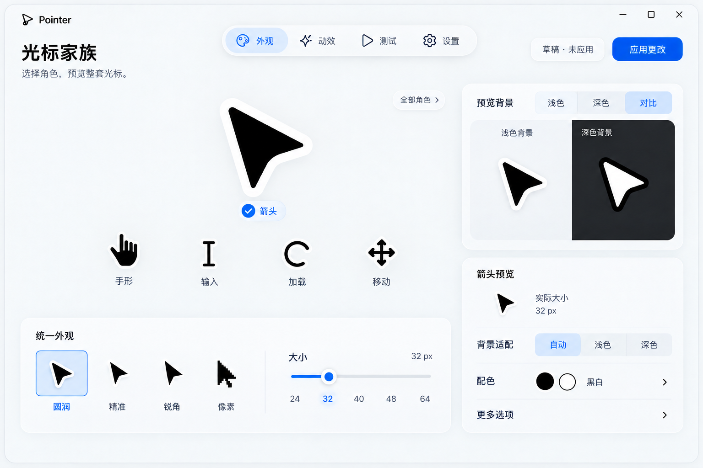
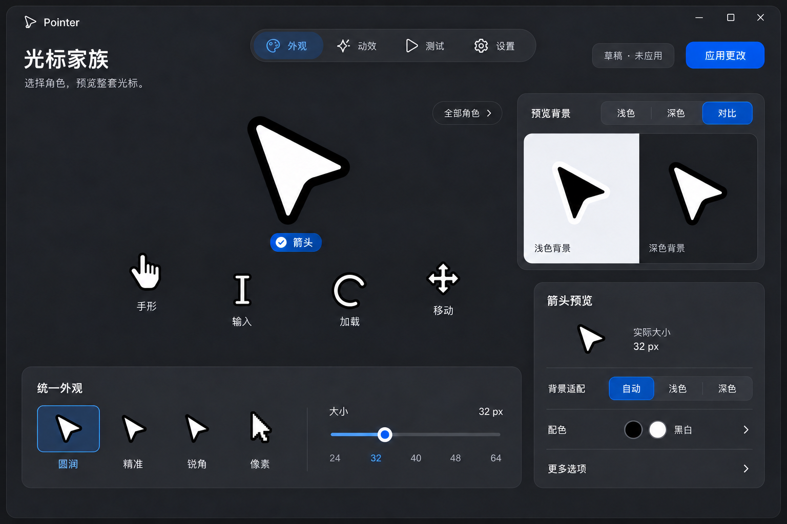
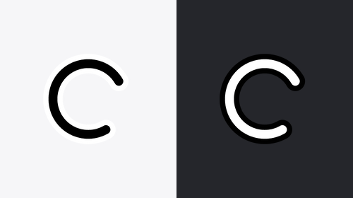

# 光标家族 · 视觉精修

日期：2026-10-06。分支：DEV。状态：B 构图已获用户确认，继续精修视觉与设计；本轮不重开方向选择，APP 界面源码未改动。按追加反馈修复了加载光标绘图源与动画资源。

用户原话：“B · 光标家族 可以，在此基础上继续更新迭代美感与设计”。批准基础构图为 apple-v3-b.png，批准范围是角色家族的组织方式。精修保留它的区域与材料世界，不再比较 A/B/C。

## 本轮重点

| 精修前 | 精修后 | 原因 |
| --- | --- | --- |
| 角色来自不同示意笔触，大小相近时视觉重量不一致 | 以现有 cursor/art 的真实轮廓为参照，按视觉重量校准小角色 | 让整套光标具有共同语言 |
| 大型蓝色勾选标记与角色竞争 | 简洁的角色标签和清晰选择提示 | 光标仍是主体 |
| 浅色观察选中时又显示深色配对 | 配对观察默认选中“对比” | 观察状态与画面一致 |
| 预览背景与系统适配含义可能混淆 | 上方“预览背景”，下方独立“背景适配” | 分清仅影响预览与应用配置的选项 |
| 形状选择有多层轮廓框 | 仅当前形状具有清晰选择区域，其余共享开放表面 | 减轻工具区，保留可辨认状态 |
| 大小在说明中出现，没有实际尺度样本 | 在尺寸值旁显示实际大小样本，放大角色保持独立 | 方便评估真实使用尺寸 |
| 浅色稿较完整，深色尚未成套 | 两主题采用相同区域、焦点和控件规则 | 深色具有同样的材质与可读性 |

## 锁定的骨架

顶左标题与品牌、顶部主导航、顶右草稿状态与应用操作；中左当前角色与浅弧小角色；右上配对背景；左下统一外观工具架；右下预览与适配参数。

基本形状和当前尺寸属于整套配置。选择手形、输入或加载仅改变预览焦点，不新增逐角色独立配置。17 种角色来自当前 theme.ROLE_IDS；首屏保留常用角色，全部角色入口提供其他选择。除已有绘制源外，不重新设计光标曲线。

## 页面稿

高保真界面图由内置 imagegen 生成并做一次针对性修正；完整提示词、基础构图批准范围和修正记录见[生成记录](cursor-family-prompts.json)。

精修稿仍是静态设计图。照片级材质或字号只是视觉参考，实施时文字、控件、角色和动效由真实 Qt 元件及 cursor/art 实现。图片缩放不能当作实际尺寸证明。

## 加载光标修复

用户指出圆环上有放射状毛刺。使用现有 render_loading 直接绘制，复现了短线段粗描边接缝导致的透明缺口和颜色泄漏。改为一次填充内外圆弧组成的连续轮廓，保留圆润端点、270° 圆弧、24 帧及原有旋转速度。八倍采样仍用于边缘平滑，不再用模糊掩盖内部接缝。

这张对比来自真实绘图代码。浅色保持黑主体白描边，深色保持白主体黑描边。忙碌和后台加载两个角色同步修复；六份内置 ANI 已重新生成，资源版本更新为 3，升级后不会复用旧绘图缓存。没有改动启动项和原始光标备份。

回归检查覆盖两角色全部 24 帧在 96/160 像素下的圆弧内部完整性，以及旋转时的缺口与端点。完整测试运行 120 项，通过（1 项安装包集成检查未启用）。重新构建便携版后，打包 --diagnose 成功验证 34 个角色资源（含 4 个动画）、32 个按键动效资源及 256 个打包文件。验证日志保存在 ignored .local/。未发布新版本，也不把静态界面稿称为运行截图。

## 连续交互

选择角色时，角色焦点与标签同步；观察背景保持独立。鼠标反馈从当前状态接续，键盘立即更新。参数拖动直接更新草稿和可读数值；选择弹出层时焦点可返回。按住的真实轮廓仍遵循顶部向左下较明显移动、下方轻微跟随。

草稿状态使用真实 dirty 状态，应用位置固定，成功以事务完成为准。失焦和切页结束临时按下与等待。减少 UI 动效独立于光标动效；减少透明度采用同调不透明材质。

## 原生适配与保留范围

1180×800 为逻辑参考窗口；880×620 时小角色重排为固定顺序，工具区可滚动，配对背景可折叠。焦点、主操作及当前值仍可访问。文字用真实字体度量，不能缩小整张界面图。浅深文字、边缘与焦点状态需在实际 APP 中检验。

保留四造型、八配色、六动效、大小与背景策略、导入导出、更新、托盘、寻找光标、游戏暂停、启动与恢复。原始备份和未变化的启动项保留。测试页验证已应用的真实 Windows 光标，预览不能替代系统验证。

## 审阅状态与下一步

B 的基础构图已批准。Impeccable 已记录批准并关闭方向构图阶段；规格测量阶段尚未完成。本轮只是对同一构图的视觉精修，不表示 Windows 构建就绪。

下一步将精修后的度量与真实源代码结合到实施规格，不另开风格投票。正式产品实现之后，再进行布局、输入、真实光标及事务验证，运行完整 unittest 和打包 --diagnose，并独立审查。发布仍需单独请求，本轮推送设计资料到 DEV。
